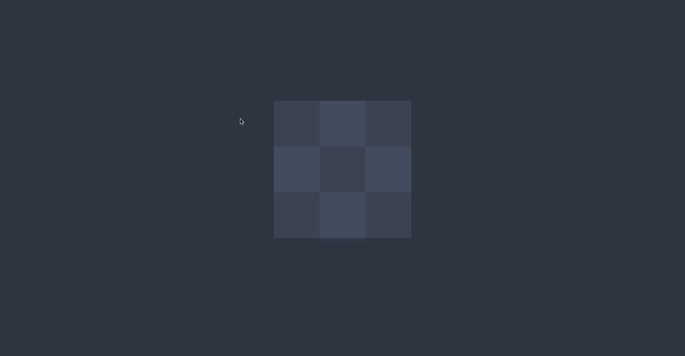
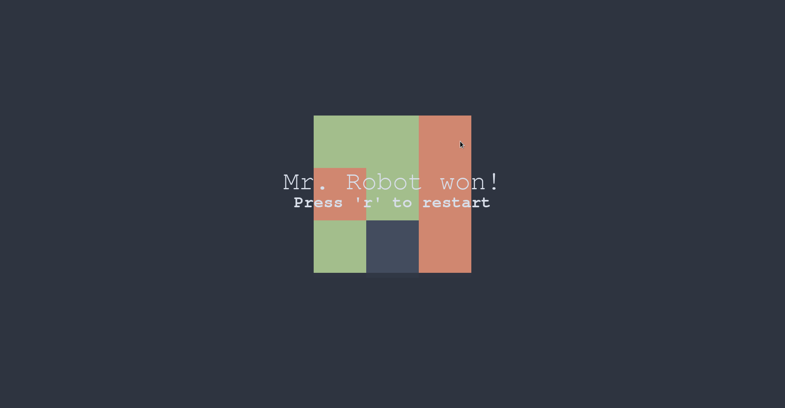

# Tic-Tac-Toe
A Tic-Tac-Toe game made during one evening using [Birb2D](https://github.com/toasterbirb/birb2d). The game doesn't yet have any menus to configure the game board size or player configuration, but I might add those later on.

